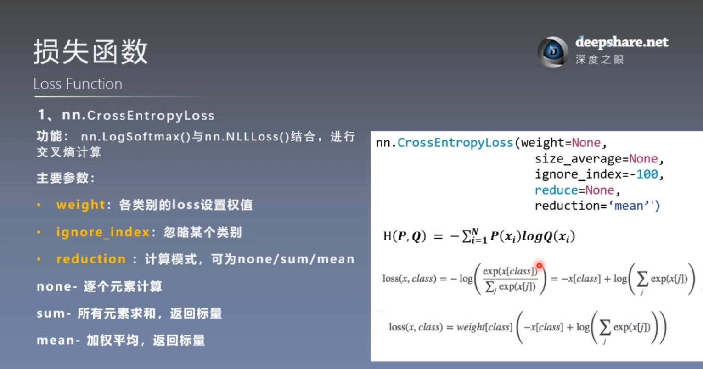
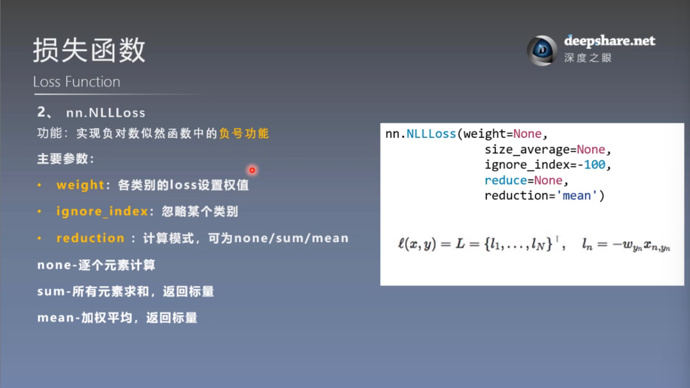
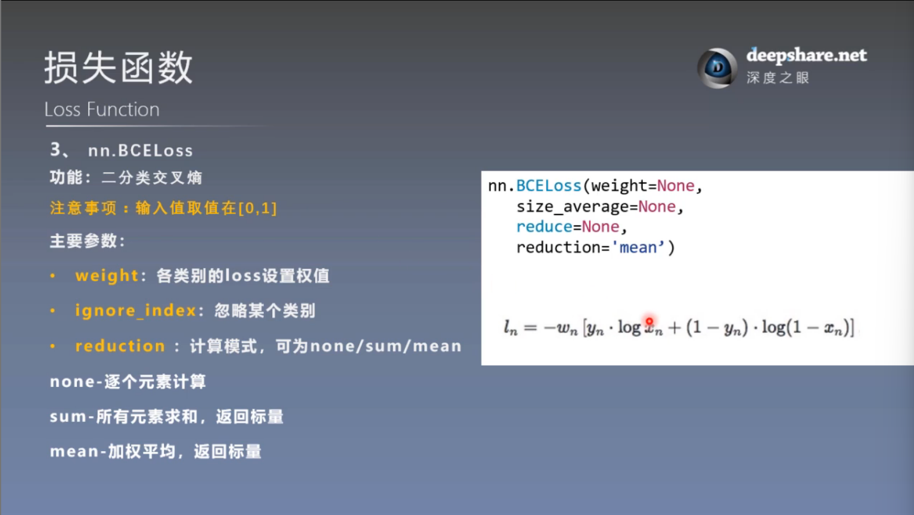
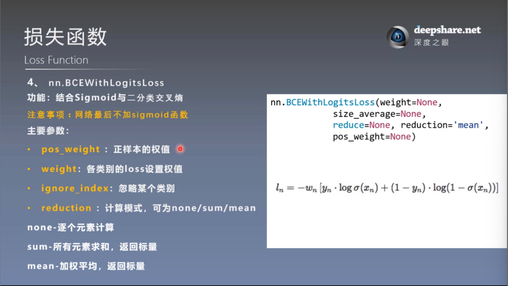

# 损失函数（1）
## 一. 损失函数概念

### 1. 损失函数是什么


不失一般性，我们以后研究问题时，损失函数都是指代价函数，即衡量模型输出与真实标签的差异时，都称为Loss

损失函数不是越小越好，因为可能会导致过拟合，所以在目标函数中除了Cost还要加一个Regularization，即正则项

### 2. _Loss类的基本形式


\_Loss类是pytorch中损失函数的基类，所有损失函数最终都继承于\_Loss类

而_Loss类又继承Module类，所以损失函数也可以看成是Module

### 实际使用方式

1. 通过一个损失函数类实例化损失函数对象，损失函数类一般pytorch会提供

    例

    ```json
    loss_f_mean = nn.CrossEntropyLoss(weight=None, reduction='mean')
    ```
2. 用损失函数对象计算loss

    例

    ```json
    loss_mean = loss_f_mean(inputs, target)
    ```

## 二. 交叉熵损失函数
### 1. 基本知识
#### （1）信息量
信息是用来消除随机不确定性的东西，衡量信息量的大小就是看这个信息消除不确定性的程度

**信息量的大小与信息发生的概率成反比**

设某一事件发生的概率为 $\mathbf{P}(x)$

$\mathbf{I}(x)=-\log_{}{\mathbf{P}(x)}$

其中 $\mathbf{I}(x)$ 表示信息量，这里 $\log$ 表示以 $\mathrm{e}$ 为底的自然对数

#### （2）信息熵
信息熵也称为熵，用来表示所有信息量的期望  
信息熵可以表示为：（ $X$ 是一个离散型随机变量）

$\mathrm{H}(X)=-\sum\limits_{i=1}^{n}{\mathrm{P}(x_i)\log(\mathrm{P}(x_i))}$

#### （3）相对熵（KL散度）
如果对于同一个随机变量 X 有两个单独的概率分布 P(x) 和 Q(x)，则我们可以使用KL散度来衡量**这两个概率分布之间的差异**

$\mathrm{D}_{KL}(p||q)=\sum\limits_{i=1}^{n}{p(x_i)\log\Big(\frac{p(x_i)}{q(x_i)}\Big)}$

在机器学习中，常常使用 $\mathrm{P}(x)$ 来表示样本的真实分布，$\mathrm{Q}(x)$ 来表示模型所预测的分布

KL散度越小，表示 $\mathrm{P}(x)$ 与 $\mathrm{Q}(x)$ 的分布更加接近，可以通过反复训练 $\mathrm{Q}(x)$ 来使 $\mathrm{Q}(x)$ 的分布逼近$\mathrm{P}(x)$

#### （4）交叉熵
首先将KL散度公式拆开：

$\mathrm{D}_{KL}(p||q)=\sum\limits_{i=1}^{n}{p(x_i)\log\Big(\frac{p(x_i)}{q(x_i)}\Big)}=\sum\limits_{i=1}^{n}{p(x_i)\log(p(x_i))}-\sum\limits_{i=1}^{n}{p(x_i)\log(q(x_i))}=-\mathrm{H}(p(x))+\Big[-\sum\limits_{i=1}^{n}{p(x_i)\log(q(x_i))}\Big]$

前者：$\mathrm{H}(p(x))$ 表示信息熵，后者即为交叉熵，**KL散度 = 交叉熵 - 信息熵**

在机器学习训练网络时，输入数据与标签常常已经确定，那么真实概率分布 $\mathrm{P}(x)$ 也就确定下来了，所以信息熵在这里就是一个常量。由于KL散度的值表示真实概率分布 $\mathrm{P}(x)$ 与预测概率分布 $\mathrm{Q}(x)$ 之间的差异，值越小表示预测的结果越好，所以需要最小化KL散度，而交叉熵等于KL散度加上一个常量（信息熵），且公式相比KL散度更加容易计算，所以在机器学习中常常使用交叉熵损失函数来计算loss就行了。

#### （5）交叉熵的应用
在分类问题中常常使用交叉熵作为loss函数

一个batch的loss为：

$\mathrm{loss}=\displaystyle-\frac{1}{m}\sum\limits_{i=1}^{m}\sum\limits_{j=1}^{n}{p(x_{ij})\log{q(x_{ij})}}$

此处：m 为一个batch的样本数，n为所有分类种类

注：
1. 交叉熵在分类问题中与softmax是标配，softmax将输出结果进行处理，使其多个分类的预测值和为1（为了满足概率的性质），再通过交叉熵来计算损失

2. softmax是一种常见的激活函数，主要用于多类别分类问题的输出层。它将一个向量（通常是模型的输出）转换为一个概率分布，保证输出的每个元素都在0和1之间，并且所有元素的和为1

    对于一个输入向量 $\mathbf{z}=[\,z_1\,,\,z_2\,,\,\dots\,,\,z_n\,]$ , Softmax输出 $\mathbf{y}=[\,y_1\,,\,y_2\,,\,\dots\,,\,y_n\,]$ 计算如下：

    $y_i=\displaystyle\frac{e^{z_i}}{\sum\limits_{j=1}^{n}{e^{z_j}}}$

### 2. pytorch提供的交叉熵损失函数
#### （1）torch.nn.CrossEntropyLoss
是 PyTorch 中用于**多类别分类任务**的损失函数，广泛用于训练神经网络模型时评估模型预测的概率分布与实际标签之间的差异。它结合了 **Softmax** 激活函数和 负对数似然损失（Negative Log Likelihood Loss, **NLLLoss**）



```json
inputs = torch.tensor([[1, 2], [1, 3], [1, 3]], dtype=torch.float)
target = torch.tensor([0, 1, 1], dtype=torch.long)

loss_none = loss_f_none(inputs, target)
loss_sum = loss_f_sum(inputs, target)
loss_mean = loss_f_mean(inputs, target)

# 手动实现
idx = 0

input_1 = inputs.detach().numpy()[idx]  # [1,2]
target_1 = target.numpy()[idx]          # 0

# 第一项
x_class = input_1[target_1]

# 第二项
sigma_exp_x = np.sum(list(map(np.exp, input_1)))
log_sigma_exp_x = np.log(sigma_exp_x)

# 输出loss
loss_1 = -x_class + log_sigma_exp_x
print("第一个样本loss为: ", loss_1)
```
注：

1. 输入格式：

    - 输入（input）：它是模型的输出 logits，形状为 (batch_size, num_classes)，其中 batch_size 是样本数量，num_classes 是类别数量。注意，这里的 input 是未经过 Softmax 处理的**原始分数（logits）**
    - 目标（target）：它是真实标签，形状为 (batch_size,)，其中每个元素是一个整数，表示类别的索引（非one-hot编码），标签的值范围是 [0, num_classes-1]

2. 观察单个样本的交叉熵的计算公式：

    $\displaystyle-\log\Big(\frac{\exp{x[class]}}{\sum_{j}{\exp{x[j]}}}\Big)$

    我们的目的是使预测结果与真实标签的差距尽量小，根据公式的意思，公示的绝对值的含义实际上就是——真实标签类型对应的样本的预测值占所有类别预测值的比例，我们的目标就是使其最大，因为所占的比例越大，预测结果与真实标签就越接近。
    
    前面加一个负号，我们的目标就变成了使这整个函数最小，所以可以将其作为我们要最小化的目标函数
3. weight：可选的类别权重，用于给每个类别分配不同的权重。如果某些类别的重要性更高，可以使用该参数来增强它们对损失的贡献

    在计算均值的过程中，如果有weight，实际上是对每个样本的loss进行加权平均
    
    具体操作就是
    1. **首先计算每个样本的损失（无权重的损失）**：即计算每个样本的 **交叉熵损失**，这些损失是基于模型的输出 logits 和真实标签计算的。

    2. **根据每个样本的真实标签类别**，计算该类别的 **类别权重**，然后将这个权重应用到每个样本的损失上。

    3. **加权平均**：每个样本的损失通过对应类别的权重加权，然后对所有样本的加权损失求平均，得到最终的损失值。

## 三. NLL/BCE/BCEWithLogits Loss
#### 1. nn.NLLLoss



#### 2. nn.BCELoss



注意：此处输入真实标签为one-hot编码

ont-hot编码：是一种常用的类别数据表示方法

例如：

假设有一个分类问题，有 3 个类别：[A, B, C]。将这 3 个类别进行 One-hot 编码后：

类别 A 会被编码为 [1, 0, 0]

类别 B 会被编码为 [0, 1, 0]

类别 C 会被编码为 [0, 0, 1]

#### 3. nn.BCEWithLogitsLoss

