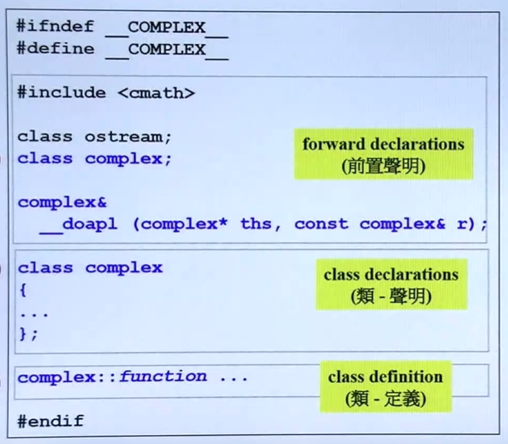

# 一些知识点

## 0. 头文件基本规范

## 1. Initial List

## 2.函数该不该加const

## 3. 参数传递尽量pass by reference ，加不加const要考虑

## 4. 返回值尽量return by reference，要考虑by value，如果传出去的东西不是local object，不是函数体内创建的，就可以传引用（一般就是引用传入的参数）

## 5. 数据放在private，函数被外界调用，放public

## 6. 头文件防卫式guard定义

## 7.操作符重载为成员函数还是非成员函数，看其作用的对象是不是该类的对象（操作符的作用对象一般是左边）

## 8.都建议inline

## 9. 友元函数，可以直接取private的数据

## 10. classname() ——> 创建一个新的类的对象(临时对象)

## 11. 在类中定义的函数默认为inline

## 12. 拷贝赋值函数检测自我赋值

## 13. new和delet作用，分析实际内存空间

## 14. 有指针的类要注意Big Three

## 15. 基于对象和面向对象

## 16. 类之间的关系：Composition（复合），Delegation（委托），Inheritance（继承）

## 17. 转换函数和non-explicit-one-argument ctor区别，把这个东西转换成别的东西vs把别的东西转换成这个东西（隐式，自动类型转换）

